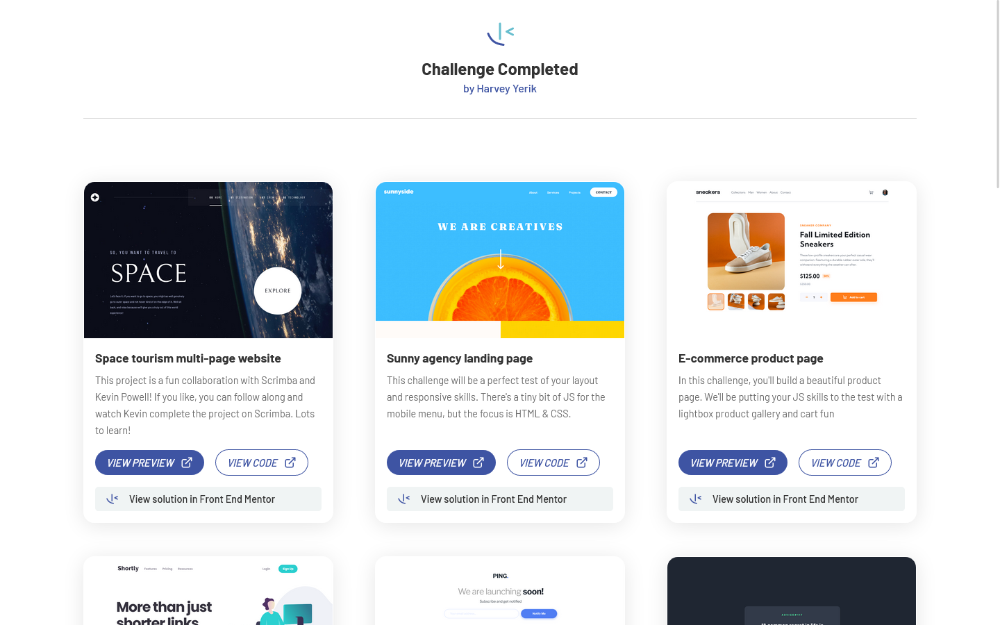

# Front end Mentor, Challenge completed
Interface that shows all the solutions to the challenges of Front End Mentor, developed with React.
## Development 
### Project structure

Important Folders:
- **public:** This folder contains almost all the files used by the application, and is consumed by useFetch.tsx.
- **src:**
  - **assets**: Files also used in the application.
  - **components**: All the components are here.
  - **context:** Contexts are here, including useFetch which provides data to the other components that need it.
  - **helpers:** Most of the logic is here.
  - **hook:** The only custom hook, useFetch.tsx.
  - **interface:** Interfaces to be more explicit.
  - **styles:** All the styles used, mostly or almost all of them are .ts files.

### Technologies used in the project
1. [React](https://es.reactjs.org/) + [TypeScript](https://www.typescriptlang.org/)
1. [styled-components](https://styled-components.com/)
1. [Vite](https://vitejs.dev/)

## Demo 

### Screenshots

## Author

- Harvey Yerik

    - [Twitter](https://twitter.com/yerikhar)
    - [GitHub](https://github.com/YerikAH)
    - [Send Me A Message](https://yerikah.github.io/send-me-a-message/dist/)
